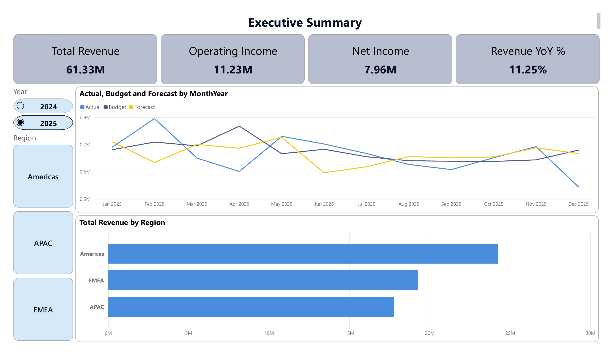
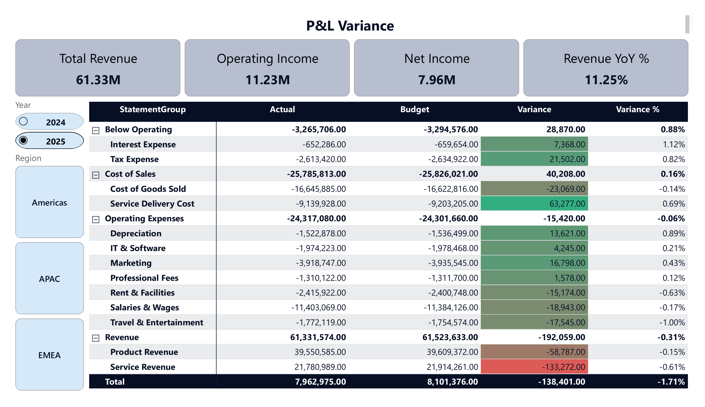
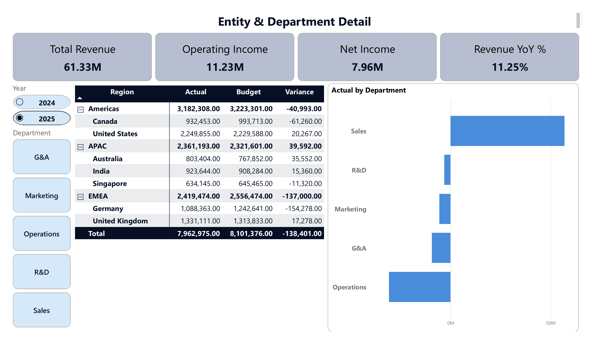

# Budget vs Actual & Consolidation Dashboard

A multi-entity budget-vs-actual dashboard built in Power BI, modelling financial data the
way enterprise performance management systems do — dimensional star schema, chart of
accounts, entity consolidation, and Actual / Budget / Forecast scenarios.



---

## What this shows

A group finance view of a seven-entity business across three regions. The dashboard answers
three questions: how did the year perform against plan, where did the variance come from,
and which entities and cost centres drove it.

Built on a monthly general-ledger-style dataset covering FY2024–FY2025, with all three
scenarios available for both years.

## Key findings

- **Revenue grew 11.2% year over year**, from $55.1M in 2024 to $61.3M in 2025
- Revenue finished **$0.19M under budget** — the main driver of the full-year shortfall
- Drilling into the shortfall, **service revenue accounts for most of it** — $133K of the
  $192K miss, against $59K on product revenue
- Lower cost of sales (**$0.04M favourable**) offset part of it, leaving net income at
  **$7.96M against an $8.10M plan**
- Regional concentration is the more interesting story: Americas is the largest single
  region at $24.3M, but it is almost entirely the United States ($16.8M). EMEA's $19.3M is
  split far more evenly between the UK and Germany — a materially different risk profile
  behind similar-looking totals.



## How it's built

**Data model — star schema.** One fact table (10,080 rows of monthly amounts) surrounded by
five dimensions: date, entity, account, scenario, and department. All relationships are
one-to-many, single direction, so filters flow from dimensions into the fact table.

| Table | Rows | Description |
|---|---|---|
| FactFinancials | 10,080 | Monthly amount per entity, account, scenario, department |
| DimEntity | 7 | Legal entities rolling up to 3 regions |
| DimAccount | 13 | Chart of accounts with statement groupings |
| DimScenario | 3 | Actual, Budget, Forecast |
| DimDepartment | 5 | Cost centres |
| DimDateDaily | 730 | Daily calendar (DAX-generated) |

**Sign convention.** Revenue is stored positive, expenses negative, so `SUM(Amount)` returns
net income directly and statement subtotals come from filtering the statement group. It also
means variance polarity is consistent across the whole P&L — a positive variance on any line
raises net income and is favourable, with no favourability adjustment needed.

**Key measures.**

```dax
Actual = CALCULATE( SUM(FactFinancials[Amount]), DimScenario[Scenario] = "Actual" )

Gross Profit = CALCULATE( [Actual],
    DimAccount[StatementGroup] IN { "Revenue", "Cost of Sales" } )

Variance = [Actual] - [Budget]

Revenue YoY % = DIVIDE( [Total Revenue] - [Revenue PY], ABS([Revenue PY]) )
```

**Consolidation** is demonstrated through the entity hierarchy — drilling from region to
entity decomposes the group total into its components, which is what consolidation means in
practice.



## Data provenance and limitations

The dataset is **synthetic**, generated with a Python script (written with Claude; included
in `/data`) to model structures that are difficult to find in public data: multi-entity
consolidation, three planning scenarios, and a chart of accounts with proper statement
groupings. The generation script derives cost of sales from revenue so gross margin stays
realistic (within 0.6 percentage points across 24 months) and holds department allocations
constant across scenarios so departmental variance is meaningful.

Known limitations, stated deliberately:

- **Single currency.** No FX translation. Doing it properly requires average rates for the
  P&L, closing rates for the balance sheet, and a cumulative translation adjustment.
- **P&L only.** No balance sheet, so no balance check or cash flow.
- **Calendar fiscal year**, with no adjustment period.

## Repository contents

```
├── Budget-vs-Actual-Consolidation-Dashboard.pbix
├── data/
│   ├── dataset.xlsx
│   └── generate_dataset.py
├── screenshots/
│   ├── 01-executive-summary.png
│   ├── 02-pl-variance.png
│   └── 03-entity-detail.png
└── README.md
```

## Tools

Power BI Desktop · Power Query · DAX · Python (data generation)
